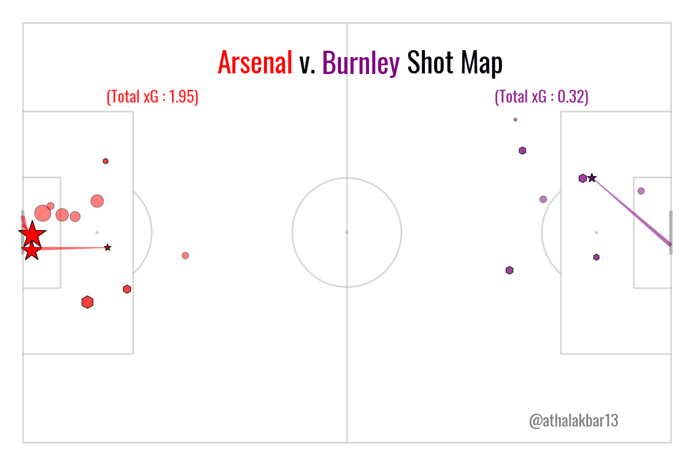

.. code:: ipython3

    #import libraries
    import re
    import json
    import pandas as pd
    from mplsoccer import Pitch,VerticalPitch
    
    from matplotlib.colors import to_rgba
    import numpy as np
    import matplotlib.pyplot as plt
    import requests
    from bs4 import BeautifulSoup

.. code:: ipython3

    combined_df = pd.read_excel('/Users/athalkhan/desktop/arsenalvburnleyshots.xlsx')
    combined_df['markersize'] = combined_df['xg'] * 2000
    combined_df

.. raw:: html

    

    
    <table border="1" class="dataframe">
      <thead>
        <tr style="text-align: right;">
          <th></th>
          <th>Name</th>
          <th>name.1</th>
          <th>isHome</th>
          <th>shotType</th>
          <th>situation</th>
          <th>x</th>
          <th>y</th>
          <th>bodyPart</th>
          <th>goalMouthLocation</th>
          <th>xgoal</th>
          <th>ygoal</th>
          <th>xg</th>
          <th>id</th>
          <th>time</th>
          <th>addedTime</th>
          <th>markersize</th>
        </tr>
      </thead>
      <tbody>
        <tr>
          <th>0</th>
          <td>shotmap</td>
          <td>Michael Obafemi</td>
          <td>False</td>
          <td>miss</td>
          <td>assisted</td>
          <td>19.7</td>
          <td>42.1</td>
          <td>right-foot</td>
          <td>left</td>
          <td>0</td>
          <td>60.3</td>
          <td>0.034741</td>
          <td>2326358</td>
          <td>90</td>
          <td>10.0</td>
          <td>69.481179</td>
        </tr>
        <tr>
          <th>1</th>
          <td>shotmap</td>
          <td>Dara O'Shea</td>
          <td>False</td>
          <td>miss</td>
          <td>corner</td>
          <td>4.6</td>
          <td>40.1</td>
          <td>other</td>
          <td>close-high</td>
          <td>0</td>
          <td>50.9</td>
          <td>0.031740</td>
          <td>2326167</td>
          <td>86</td>
          <td>NaN</td>
          <td>63.480526</td>
        </tr>
        <tr>
          <th>2</th>
          <td>shotmap</td>
          <td>Leandro Trossard</td>
          <td>True</td>
          <td>block</td>
          <td>assisted</td>
          <td>11.2</td>
          <td>36.5</td>
          <td>right-foot</td>
          <td>low-centre</td>
          <td>0</td>
          <td>50.4</td>
          <td>0.048276</td>
          <td>2326053</td>
          <td>79</td>
          <td>NaN</td>
          <td>96.552029</td>
        </tr>
        <tr>
          <th>3</th>
          <td>shotmap</td>
          <td>Oleksandr Zinchenko</td>
          <td>True</td>
          <td>goal</td>
          <td>corner</td>
          <td>13.1</td>
          <td>46.4</td>
          <td>left-foot</td>
          <td>high-right</td>
          <td>0</td>
          <td>46.1</td>
          <td>0.037247</td>
          <td>2325970</td>
          <td>74</td>
          <td>NaN</td>
          <td>74.494280</td>
        </tr>
        <tr>
          <th>4</th>
          <td>shotmap</td>
          <td>Declan Rice</td>
          <td>True</td>
          <td>miss</td>
          <td>assisted</td>
          <td>25.1</td>
          <td>44.5</td>
          <td>right-foot</td>
          <td>close-right</td>
          <td>0</td>
          <td>42.0</td>
          <td>0.032805</td>
          <td>2325861</td>
          <td>67</td>
          <td>NaN</td>
          <td>65.610327</td>
        </tr>
        <tr>
          <th>5</th>
          <td>shotmap</td>
          <td>Luca Koleosho</td>
          <td>False</td>
          <td>miss</td>
          <td>assisted</td>
          <td>24.0</td>
          <td>23.1</td>
          <td>right-foot</td>
          <td>close-left</td>
          <td>0</td>
          <td>58.2</td>
          <td>0.007895</td>
          <td>2325837</td>
          <td>65</td>
          <td>NaN</td>
          <td>15.789174</td>
        </tr>
        <tr>
          <th>6</th>
          <td>shotmap</td>
          <td>William Saliba</td>
          <td>True</td>
          <td>goal</td>
          <td>corner</td>
          <td>1.5</td>
          <td>49.4</td>
          <td>head</td>
          <td>high-left</td>
          <td>0</td>
          <td>51.9</td>
          <td>0.644268</td>
          <td>2325734</td>
          <td>57</td>
          <td>NaN</td>
          <td>1288.536072</td>
        </tr>
        <tr>
          <th>7</th>
          <td>shotmap</td>
          <td>Gabriel Martinelli</td>
          <td>True</td>
          <td>save</td>
          <td>fast-break</td>
          <td>10.0</td>
          <td>33.4</td>
          <td>right-foot</td>
          <td>low-left</td>
          <td>0</td>
          <td>52.4</td>
          <td>0.123989</td>
          <td>2325722</td>
          <td>57</td>
          <td>NaN</td>
          <td>247.977480</td>
        </tr>
        <tr>
          <th>8</th>
          <td>shotmap</td>
          <td>Josh Brownhill</td>
          <td>False</td>
          <td>goal</td>
          <td>regular</td>
          <td>12.2</td>
          <td>36.9</td>
          <td>left-foot</td>
          <td>low-left</td>
          <td>0</td>
          <td>53.1</td>
          <td>0.065441</td>
          <td>2325686</td>
          <td>54</td>
          <td>NaN</td>
          <td>130.882666</td>
        </tr>
        <tr>
          <th>9</th>
          <td>shotmap</td>
          <td>Gabriel Magalhães</td>
          <td>True</td>
          <td>miss</td>
          <td>corner</td>
          <td>6.1</td>
          <td>54.2</td>
          <td>head</td>
          <td>right</td>
          <td>0</td>
          <td>27.1</td>
          <td>0.122601</td>
          <td>2325620</td>
          <td>50</td>
          <td>NaN</td>
          <td>245.202065</td>
        </tr>
        <tr>
          <th>10</th>
          <td>shotmap</td>
          <td>Leandro Trossard</td>
          <td>True</td>
          <td>goal</td>
          <td>assisted</td>
          <td>1.4</td>
          <td>45.6</td>
          <td>head</td>
          <td>low-left</td>
          <td>0</td>
          <td>53.9</td>
          <td>0.350074</td>
          <td>2325414</td>
          <td>45</td>
          <td>1.0</td>
          <td>700.148165</td>
        </tr>
        <tr>
          <th>11</th>
          <td>shotmap</td>
          <td>Bukayo Saka</td>
          <td>True</td>
          <td>miss</td>
          <td>assisted</td>
          <td>8.1</td>
          <td>53.8</td>
          <td>head</td>
          <td>left</td>
          <td>0</td>
          <td>59.3</td>
          <td>0.078840</td>
          <td>2325422</td>
          <td>45</td>
          <td>1.0</td>
          <td>157.680467</td>
        </tr>
        <tr>
          <th>12</th>
          <td>shotmap</td>
          <td>Gabriel Magalhães</td>
          <td>True</td>
          <td>block</td>
          <td>assisted</td>
          <td>27.2</td>
          <td>44.7</td>
          <td>left-foot</td>
          <td>low-centre</td>
          <td>0</td>
          <td>48.5</td>
          <td>0.026600</td>
          <td>2325406</td>
          <td>45</td>
          <td>NaN</td>
          <td>53.200029</td>
        </tr>
        <tr>
          <th>13</th>
          <td>shotmap</td>
          <td>Bukayo Saka</td>
          <td>True</td>
          <td>block</td>
          <td>assisted</td>
          <td>19.6</td>
          <td>68.4</td>
          <td>left-foot</td>
          <td>low-centre</td>
          <td>0</td>
          <td>51.6</td>
          <td>0.026842</td>
          <td>2325286</td>
          <td>37</td>
          <td>NaN</td>
          <td>53.683616</td>
        </tr>
        <tr>
          <th>14</th>
          <td>shotmap</td>
          <td>Leandro Trossard</td>
          <td>True</td>
          <td>save</td>
          <td>assisted</td>
          <td>16.1</td>
          <td>36.5</td>
          <td>left-foot</td>
          <td>high-left</td>
          <td>0</td>
          <td>53.2</td>
          <td>0.053299</td>
          <td>2325256</td>
          <td>36</td>
          <td>NaN</td>
          <td>106.598869</td>
        </tr>
        <tr>
          <th>15</th>
          <td>shotmap</td>
          <td>Jay Rodriguez</td>
          <td>False</td>
          <td>save</td>
          <td>assisted</td>
          <td>22.9</td>
          <td>30.5</td>
          <td>right-foot</td>
          <td>low-right</td>
          <td>0</td>
          <td>45.5</td>
          <td>0.042637</td>
          <td>2325187</td>
          <td>32</td>
          <td>NaN</td>
          <td>85.273653</td>
        </tr>
        <tr>
          <th>16</th>
          <td>shotmap</td>
          <td>Jóhann Guðmundsson</td>
          <td>False</td>
          <td>save</td>
          <td>regular</td>
          <td>13.6</td>
          <td>37.1</td>
          <td>left-foot</td>
          <td>low-right</td>
          <td>0</td>
          <td>46.7</td>
          <td>0.056643</td>
          <td>2325161</td>
          <td>31</td>
          <td>NaN</td>
          <td>113.286331</td>
        </tr>
        <tr>
          <th>17</th>
          <td>shotmap</td>
          <td>Kai Havertz</td>
          <td>True</td>
          <td>miss</td>
          <td>corner</td>
          <td>3.1</td>
          <td>54.6</td>
          <td>head</td>
          <td>high-right</td>
          <td>0</td>
          <td>44.0</td>
          <td>0.202678</td>
          <td>2325156</td>
          <td>30</td>
          <td>NaN</td>
          <td>405.356735</td>
        </tr>
        <tr>
          <th>18</th>
          <td>shotmap</td>
          <td>Jay Rodriguez</td>
          <td>False</td>
          <td>save</td>
          <td>assisted</td>
          <td>11.5</td>
          <td>55.9</td>
          <td>head</td>
          <td>high-centre</td>
          <td>0</td>
          <td>50.3</td>
          <td>0.028886</td>
          <td>2325131</td>
          <td>28</td>
          <td>NaN</td>
          <td>57.771381</td>
        </tr>
        <tr>
          <th>19</th>
          <td>shotmap</td>
          <td>Kai Havertz</td>
          <td>True</td>
          <td>miss</td>
          <td>regular</td>
          <td>11.5</td>
          <td>57.5</td>
          <td>right-foot</td>
          <td>close-right</td>
          <td>0</td>
          <td>41.8</td>
          <td>0.122961</td>
          <td>2325102</td>
          <td>25</td>
          <td>NaN</td>
          <td>245.922983</td>
        </tr>
        <tr>
          <th>20</th>
          <td>shotmap</td>
          <td>Bukayo Saka</td>
          <td>True</td>
          <td>save</td>
          <td>regular</td>
          <td>12.8</td>
          <td>67.0</td>
          <td>right-foot</td>
          <td>high-right</td>
          <td>0</td>
          <td>47.1</td>
          <td>0.022462</td>
          <td>2325037</td>
          <td>20</td>
          <td>NaN</td>
          <td>44.923246</td>
        </tr>
        <tr>
          <th>21</th>
          <td>shotmap</td>
          <td>Takehiro Tomiyasu</td>
          <td>True</td>
          <td>block</td>
          <td>regular</td>
          <td>18.5</td>
          <td>68.2</td>
          <td>left-foot</td>
          <td>low-right</td>
          <td>0</td>
          <td>48.1</td>
          <td>0.018407</td>
          <td>2325045</td>
          <td>20</td>
          <td>NaN</td>
          <td>36.813442</td>
        </tr>
        <tr>
          <th>22</th>
          <td>shotmap</td>
          <td>Zeki Amdouni</td>
          <td>False</td>
          <td>save</td>
          <td>assisted</td>
          <td>24.9</td>
          <td>59.0</td>
          <td>right-foot</td>
          <td>low-right</td>
          <td>0</td>
          <td>46.9</td>
          <td>0.048135</td>
          <td>2324883</td>
          <td>8</td>
          <td>NaN</td>
          <td>96.270069</td>
        </tr>
        <tr>
          <th>23</th>
          <td>shotmap</td>
          <td>Gabriel Magalhães</td>
          <td>True</td>
          <td>miss</td>
          <td>corner</td>
          <td>4.3</td>
          <td>56.3</td>
          <td>other</td>
          <td>high</td>
          <td>0</td>
          <td>46.7</td>
          <td>0.039947</td>
          <td>2324859</td>
          <td>6</td>
          <td>NaN</td>
          <td>79.894193</td>
        </tr>
      </tbody>
    </table>
    

.. code:: ipython3

    
                
    df1 = combined_df.loc[combined_df['isHome']==True]
    df2 = combined_df.loc[combined_df['isHome']==False]
    totalxG1= df1['xg'].sum()
    totalxG2 = df2['xg'].sum()
    totalxG1 = format(totalxG1, '.2f')
    totalxG2 = format(totalxG2, '.2f')
    
    totalxG2

.. parsed-literal::

    '0.32'

.. code:: ipython3

    df2['x'] = 100 - df2['x']
    df2['y'] = 100 - df2['y']
    df2['xgoal'] = 100 - df2['xgoal']
    df2['ygoal'] = 100 - df2['ygoal']
    df2

.. parsed-literal::

    /var/folders/9f/4060p_s95t36pv0wnw4zyfqm0000gn/T/ipykernel_5899/2676422143.py:1: SettingWithCopyWarning: 
    A value is trying to be set on a copy of a slice from a DataFrame.
    Try using .loc[row_indexer,col_indexer] = value instead
    
    See the caveats in the documentation: https://pandas.pydata.org/pandas-docs/stable/user_guide/indexing.html#returning-a-view-versus-a-copy
      df2['x'] = 100 - df2['x']
    /var/folders/9f/4060p_s95t36pv0wnw4zyfqm0000gn/T/ipykernel_5899/2676422143.py:2: SettingWithCopyWarning: 
    A value is trying to be set on a copy of a slice from a DataFrame.
    Try using .loc[row_indexer,col_indexer] = value instead
    
    See the caveats in the documentation: https://pandas.pydata.org/pandas-docs/stable/user_guide/indexing.html#returning-a-view-versus-a-copy
      df2['y'] = 100 - df2['y']
    /var/folders/9f/4060p_s95t36pv0wnw4zyfqm0000gn/T/ipykernel_5899/2676422143.py:3: SettingWithCopyWarning: 
    A value is trying to be set on a copy of a slice from a DataFrame.
    Try using .loc[row_indexer,col_indexer] = value instead
    
    See the caveats in the documentation: https://pandas.pydata.org/pandas-docs/stable/user_guide/indexing.html#returning-a-view-versus-a-copy
      df2['xgoal'] = 100 - df2['xgoal']
    /var/folders/9f/4060p_s95t36pv0wnw4zyfqm0000gn/T/ipykernel_5899/2676422143.py:4: SettingWithCopyWarning: 
    A value is trying to be set on a copy of a slice from a DataFrame.
    Try using .loc[row_indexer,col_indexer] = value instead
    
    See the caveats in the documentation: https://pandas.pydata.org/pandas-docs/stable/user_guide/indexing.html#returning-a-view-versus-a-copy
      df2['ygoal'] = 100 - df2['ygoal']

.. raw:: html

    

    
    <table border="1" class="dataframe">
      <thead>
        <tr style="text-align: right;">
          <th></th>
          <th>Name</th>
          <th>name.1</th>
          <th>isHome</th>
          <th>shotType</th>
          <th>situation</th>
          <th>x</th>
          <th>y</th>
          <th>bodyPart</th>
          <th>goalMouthLocation</th>
          <th>xgoal</th>
          <th>ygoal</th>
          <th>xg</th>
          <th>id</th>
          <th>time</th>
          <th>addedTime</th>
          <th>markersize</th>
        </tr>
      </thead>
      <tbody>
        <tr>
          <th>0</th>
          <td>shotmap</td>
          <td>Michael Obafemi</td>
          <td>False</td>
          <td>miss</td>
          <td>assisted</td>
          <td>80.3</td>
          <td>57.9</td>
          <td>right-foot</td>
          <td>left</td>
          <td>100</td>
          <td>39.7</td>
          <td>0.034741</td>
          <td>2326358</td>
          <td>90</td>
          <td>10.0</td>
          <td>69.481179</td>
        </tr>
        <tr>
          <th>1</th>
          <td>shotmap</td>
          <td>Dara O'Shea</td>
          <td>False</td>
          <td>miss</td>
          <td>corner</td>
          <td>95.4</td>
          <td>59.9</td>
          <td>other</td>
          <td>close-high</td>
          <td>100</td>
          <td>49.1</td>
          <td>0.031740</td>
          <td>2326167</td>
          <td>86</td>
          <td>NaN</td>
          <td>63.480526</td>
        </tr>
        <tr>
          <th>5</th>
          <td>shotmap</td>
          <td>Luca Koleosho</td>
          <td>False</td>
          <td>miss</td>
          <td>assisted</td>
          <td>76.0</td>
          <td>76.9</td>
          <td>right-foot</td>
          <td>close-left</td>
          <td>100</td>
          <td>41.8</td>
          <td>0.007895</td>
          <td>2325837</td>
          <td>65</td>
          <td>NaN</td>
          <td>15.789174</td>
        </tr>
        <tr>
          <th>8</th>
          <td>shotmap</td>
          <td>Josh Brownhill</td>
          <td>False</td>
          <td>goal</td>
          <td>regular</td>
          <td>87.8</td>
          <td>63.1</td>
          <td>left-foot</td>
          <td>low-left</td>
          <td>100</td>
          <td>46.9</td>
          <td>0.065441</td>
          <td>2325686</td>
          <td>54</td>
          <td>NaN</td>
          <td>130.882666</td>
        </tr>
        <tr>
          <th>15</th>
          <td>shotmap</td>
          <td>Jay Rodriguez</td>
          <td>False</td>
          <td>save</td>
          <td>assisted</td>
          <td>77.1</td>
          <td>69.5</td>
          <td>right-foot</td>
          <td>low-right</td>
          <td>100</td>
          <td>54.5</td>
          <td>0.042637</td>
          <td>2325187</td>
          <td>32</td>
          <td>NaN</td>
          <td>85.273653</td>
        </tr>
        <tr>
          <th>16</th>
          <td>shotmap</td>
          <td>Jóhann Guðmundsson</td>
          <td>False</td>
          <td>save</td>
          <td>regular</td>
          <td>86.4</td>
          <td>62.9</td>
          <td>left-foot</td>
          <td>low-right</td>
          <td>100</td>
          <td>53.3</td>
          <td>0.056643</td>
          <td>2325161</td>
          <td>31</td>
          <td>NaN</td>
          <td>113.286331</td>
        </tr>
        <tr>
          <th>18</th>
          <td>shotmap</td>
          <td>Jay Rodriguez</td>
          <td>False</td>
          <td>save</td>
          <td>assisted</td>
          <td>88.5</td>
          <td>44.1</td>
          <td>head</td>
          <td>high-centre</td>
          <td>100</td>
          <td>49.7</td>
          <td>0.028886</td>
          <td>2325131</td>
          <td>28</td>
          <td>NaN</td>
          <td>57.771381</td>
        </tr>
        <tr>
          <th>22</th>
          <td>shotmap</td>
          <td>Zeki Amdouni</td>
          <td>False</td>
          <td>save</td>
          <td>assisted</td>
          <td>75.1</td>
          <td>41.0</td>
          <td>right-foot</td>
          <td>low-right</td>
          <td>100</td>
          <td>53.1</td>
          <td>0.048135</td>
          <td>2324883</td>
          <td>8</td>
          <td>NaN</td>
          <td>96.270069</td>
        </tr>
      </tbody>
    </table>
    

.. code:: ipython3

    df1_missed = df1.loc[df1['shotType']=='miss']
    df2_missed = df2.loc[df2['shotType']=='miss']
    df1_saved = df1.loc[df1['shotType']=='save']
    df2_saved = df2.loc[df2['shotType']=='save']
    df1_goal = df1.loc[df1['shotType']=='goal']
    df2_goal = df2.loc[df2['shotType']=='goal']
    df2_goal
    

.. raw:: html

    

    
    <table border="1" class="dataframe">
      <thead>
        <tr style="text-align: right;">
          <th></th>
          <th>Name</th>
          <th>name.1</th>
          <th>isHome</th>
          <th>shotType</th>
          <th>situation</th>
          <th>x</th>
          <th>y</th>
          <th>bodyPart</th>
          <th>goalMouthLocation</th>
          <th>xgoal</th>
          <th>ygoal</th>
          <th>xg</th>
          <th>id</th>
          <th>time</th>
          <th>addedTime</th>
          <th>markersize</th>
        </tr>
      </thead>
      <tbody>
        <tr>
          <th>8</th>
          <td>shotmap</td>
          <td>Josh Brownhill</td>
          <td>False</td>
          <td>goal</td>
          <td>regular</td>
          <td>87.8</td>
          <td>63.1</td>
          <td>left-foot</td>
          <td>low-left</td>
          <td>100</td>
          <td>46.9</td>
          <td>0.065441</td>
          <td>2325686</td>
          <td>54</td>
          <td>NaN</td>
          <td>130.882666</td>
        </tr>
      </tbody>
    </table>
    

.. code:: ipython3

    # Set up the pitch
    import numpy as np
    import pandas as pd
    import matplotlib.pyplot as plt
    from matplotlib.colors import to_rgba
    import matplotlib.patheffects as path_effects
    from mplsoccer import Pitch, FontManager
    from highlight_text import ax_text
    
    # Specify the URL or local path to the Oswald font file
    oswald_font_url = "https://raw.githubusercontent.com/google/fonts/main/ofl/oswald/Oswald%5Bwght%5D.ttf"
    
    # Create the FontManager instance
    oswald_regular = FontManager(oswald_font_url)
    
    pitch = Pitch(pitch_type='opta', pitch_color='white', line_alpha=0.5)
    fig, ax = pitch.draw(figsize=(12,10))
    
    # Plot the completed passes
    
    pitch.scatter(df1_missed.x, df1_missed.y,color='red',s=df1_missed.markersize, ax=ax,alpha=0.5,edgecolors='#383838')
    
    pitch.scatter(df2_missed.x, df2_missed.y,color='purple',s=df2_missed.markersize, ax=ax,alpha=0.5,edgecolors='#383838')
    
    pitch.scatter(df1_saved.x, df1_saved.y,color='red',s=df1_saved.markersize,marker='h',alpha=0.75,ax=ax,edgecolors='black')
    
    pitch.scatter(df2_saved.x, df2_saved.y,color='purple',s=df2_saved.markersize,marker='h',alpha=0.75, ax=ax,edgecolors='black')
    
    pitch.scatter(df1_goal.x, df1_goal.y,color='red',s=df1_goal.markersize,marker='*', ax=ax,edgecolors='black')
    
    pitch.scatter(df2_goal.x, df2_goal.y,color='purple',s=df2_goal.markersize,marker='*', ax=ax,edgecolors='black')
    
    pitch.lines(df1_goal.x,df1_goal.y,df1_goal.xgoal,df1_goal.ygoal,color='red',comet=True,ax=ax,alpha=0.35)
    pitch.lines(df2_goal.x,df2_goal.y,df2_goal.xgoal,df2_goal.ygoal,color='purple',comet=True,ax=ax,alpha=0.35)
    
    highlight_text = [{'color': 'red', 'fontproperties': oswald_regular.prop},
                      {'color': 'purple', 'fontproperties': oswald_regular.prop}]
    ax_text(50,90,"    <Arsenal> v. <Burnley> Shot Map", size=35, color='#000009',
                                    fontproperties=oswald_regular.prop,highlight_textprops=highlight_text,
                                    ha='center', va='center',ax=ax,weight='bold')
    ax.text(85,5,"@athalakbar13", size=20, color='#000009',
                                    fontproperties=oswald_regular.prop,
                                    ha='center', va='center',alpha=0.5)
    ax.text(20,82, f"(Total xG : {totalxG1})",size=20,color='red',alpha=0.85,
    fontproperties=oswald_regular.prop,
    ha='center', va='center',weight='bold')
    ax.text(80,82, f"(Total xG : {totalxG2})",size=20,color='purple',alpha=0.85,
    fontproperties=oswald_regular.prop,
    ha='center', va='center',weight='bold')
    
    
    plt.show()

